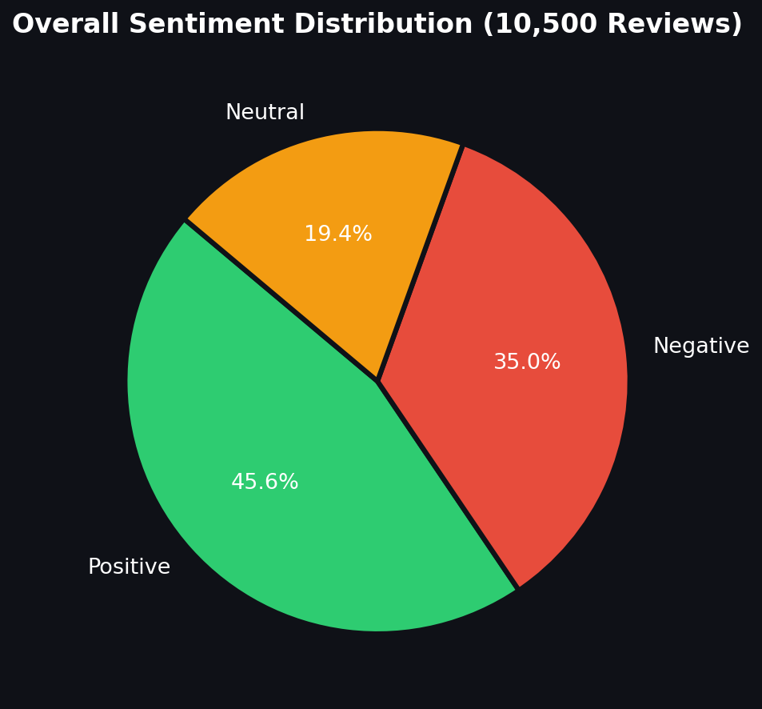
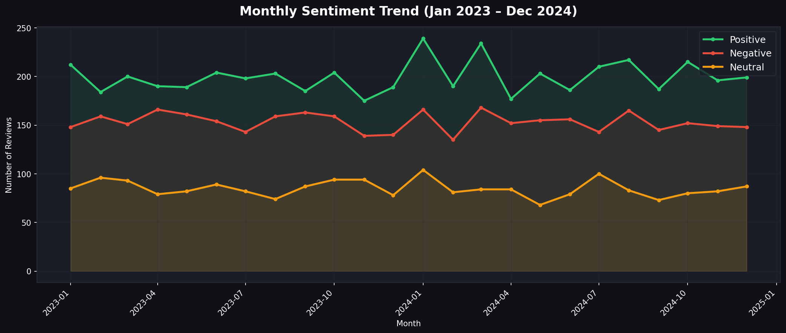
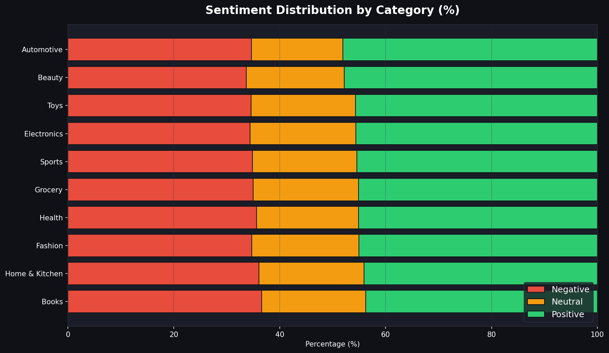
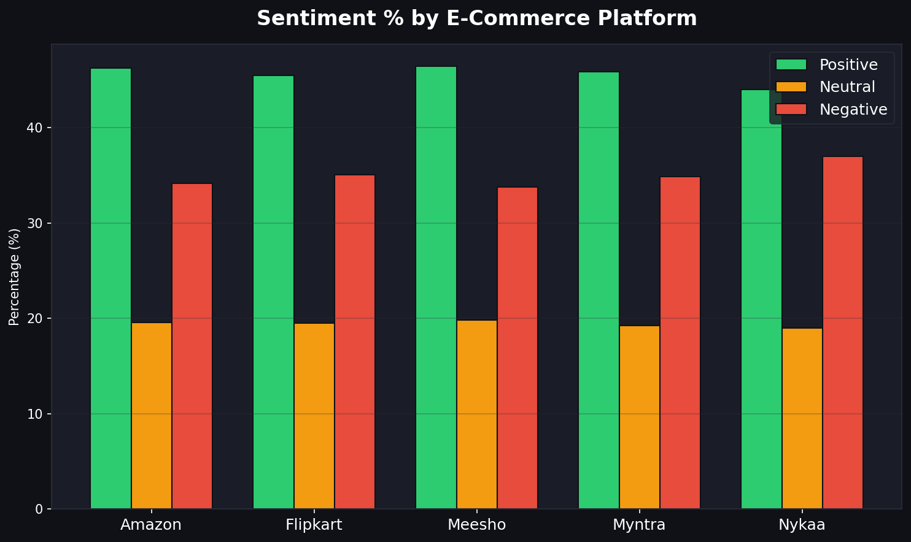
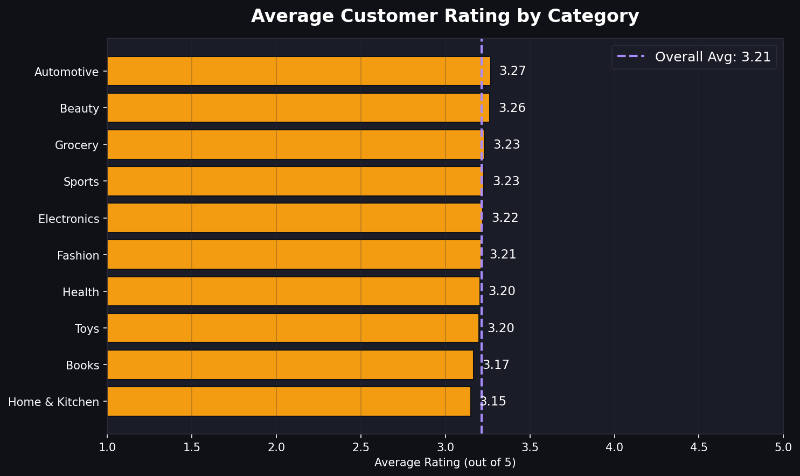

🤖 BizInsight AI Agent
> AI-powered Business Intelligence Agent for Customer Review Analytics
BizInsight AI Agent transforms customer reviews into actionable business insights through sentiment analysis, KPI tracking, trend analysis, complaint detection, visual dashboards, and an interactive chatbot.
🚀 Live Dashboard
After enabling GitHub Pages:
https://vanshiv18.github.io/BizInsight-AI-Agent/
📌 Project Objective
The system converts customer feedback into useful business intelligence by helping users monitor sentiment, identify complaints, compare categories and platforms, track trends, and generate business recommendations.
📊 Dashboard Preview
Overall Sentiment Distribution

Monthly Sentiment Trend

Sentiment by Category

Platform Sentiment Comparison

Average Rating by Category

🧠 Main Features
Positive, negative, and neutral sentiment analysis
KPI dashboard with review volume, sentiment percentages, average rating, and sentiment score
Monthly sentiment trend analysis
Category-level sentiment comparison
E-commerce platform benchmarking
Recurring complaint detection
Data-driven business recommendations
Interactive rule-based business intelligence chatbot
🛠️ Technology Stack
Python
Pandas and NumPy
Matplotlib and Seaborn
HTML, CSS, and JavaScript
Sentiment Analysis
Exploratory Data Analysis
Business Intelligence
📁 Repository Structure
```text
BizInsight-AI-Agent/
├── CodeDisruptive.py
├── index.html
├── bi_agent_dashboard_v3.html
├── customer_reviews_dataset.csv
├── chart1_sentiment_pie.png
├── chart2_monthly_trend.png
├── chart3_category_sentiment.png
├── chart4_platform_sentiment.png
└── chart5_avg_rating.png
```
▶️ Run Locally
```bash
git clone https://github.com/Vanshiv18/BizInsight-AI-Agent.git
cd BizInsight-AI-Agent
pip install pandas matplotlib seaborn
python CodeDisruptive.py
```
Open `index.html` in your browser to view the dashboard.
🌐 Enable GitHub Pages
Open Settings in the repository.
Select Pages.
Choose Deploy from a branch.
Select the branch containing `index.html`, usually `main`.
Select `/ (root)`.
Click Save.
Ensure the dashboard file is named exactly `index.html`.
💼 Business Value
The project converts unstructured customer feedback into measurable insights that support customer experience improvement, complaint monitoring, platform comparison, and business decision-making.
👤 Author
Vanshiv Rana  
MBA – Data Science & Artificial Intelligence  
Lovely Professional University
